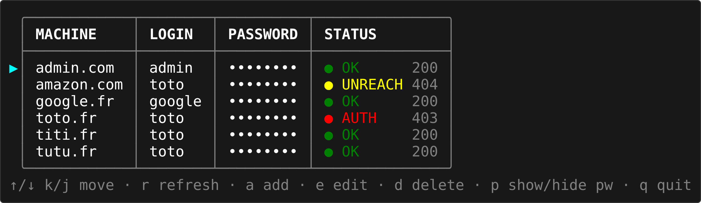

# netrc-manager

An interactive terminal UI for managing `~/.netrc` credentials, with live connection checks.



## Requirements

- bash 4+
- curl

## Usage

```
./netrc-manager.sh [options]

Options:
  -r, --refresh SECONDS   Auto-refresh every SECONDS (0 = off)
  -h, --help              Show this help and exit
```

### Environment variables

| Variable | Default | Description |
|---|---|---|
| `NETRC` | `~/.netrc` | Path to the netrc file |
| `NETRC_REFRESH_INTERVAL` | `0` | Auto-refresh interval in seconds |

## Keybindings

| Key | Action |
|---|---|
| `↑` / `k` | Move up |
| `↓` / `j` | Move down |
| `a` | Add a new machine entry |
| `e` | Edit selected entry (login / password) |
| `d` | Delete selected entry |
| `p` | Show / hide passwords |
| `r` | Refresh now |
| `q` | Quit |

## Status indicators

| Icon | Meaning |
|---|---|
| `● OK` | Reachable and credentials accepted (HTTP 2xx/3xx) |
| `● AUTH` | Reachable but credentials rejected (HTTP 401/403) |
| `● UNREACH` | Unreachable or unexpected HTTP code |
| `● CHECKING` | Check in progress |

## Files

| File | Description |
|---|---|
| `netrc-manager.sh` | Main interactive manager |
| `netrc-manager-check-machine.sh` | Sourceable library for credential validation |

## Custom check (`netrc-manager-check-machine.sh`)

The checker is a sourced library that exposes one function and three variables you can override before sourcing it (or in a forked copy).

### Configuration variables

| Variable | Default | Description |
|---|---|---|
| `NETRC_CHECK_NETRC_FILE` | `~/.netrc` | netrc file used by curl |
| `NETRC_CHECK_TIMEOUT_CONNECT` | `8` | curl `--connect-timeout` (seconds) |
| `NETRC_CHECK_TIMEOUT_MAX` | `15` | curl `--max-time` (seconds) |

### `netrc_manager_check_machine <machine>`

Checks reachability and credential validity for the given machine name. Echoes one of:

- `success:<http_code>` — reachable and credentials accepted
- `auth_fail:<http_code>` — reachable but credentials rejected (401/403)
- `connect_fail:<http_code|UNREACHABLE>` — unreachable or unexpected code

Returns `0` on `success`, `1` otherwise.

### Adding a custom machine check

The function contains a dispatch block. Add a new `if/elif` branch before the `else` (generic HTTPS) fallback to handle a machine with non-standard auth:

```bash
netrc_manager_check_machine() {
    local machine="$1"
    local test_url=""
    local http_code=""

    if [[ "git.example.com" == "${machine}" ]]; then
        test_url="https://git.example.com/api/v4/user"
        http_code="$(curl -s -o /dev/null \
            -w "%{http_code}" \
            --netrc-file "${NETRC_CHECK_NETRC_FILE}" \
            --connect-timeout "${NETRC_CHECK_TIMEOUT_CONNECT}" \
            --max-time "${NETRC_CHECK_TIMEOUT_MAX}" \
            "${test_url}" 2>/dev/null)" || true
    elif [[ "amazon.com" == "${machine}" ]]; then
        test_url="https://www.amazon.com/login"
        http_code="$(curl -s -o /dev/null \
            -w "%{http_code}" \
            --netrc-file "${NETRC_CHECK_NETRC_FILE}" \
            --connect-timeout "${NETRC_CHECK_TIMEOUT_CONNECT}" \
            --max-time "${NETRC_CHECK_TIMEOUT_MAX}" \
            -L --max-redirs 5 \
            "${test_url}" 2>/dev/null)" || true
    else
        test_url="https://${machine}/"
        http_code="$(curl -s -o /dev/null \
            -w "%{http_code}" \
            --netrc-file "${NETRC_CHECK_NETRC_FILE}" \
            --connect-timeout "${NETRC_CHECK_TIMEOUT_CONNECT}" \
            --max-time "${NETRC_CHECK_TIMEOUT_MAX}" \
            -L --max-redirs 5 \
            "${test_url}" 2>/dev/null)" || true
    fi

    if [[ "${http_code}" =~ ^[0-9]+$ ]]; then
        case "${http_code}" in
            200|301|302|303|307|308)
                echo "success:${http_code}"
                return 0
                ;;
            401|403)
                echo "auth_fail:${http_code}"
                return 1
                ;;
            *)
                echo "connect_fail:${http_code}"
                return 1
                ;;
        esac
    else
        echo "connect_fail:UNREACHABLE"
        return 1
    fi
}
```

The `http_code` value flows into the existing `case` block at the bottom of the function, so no further changes are needed.
